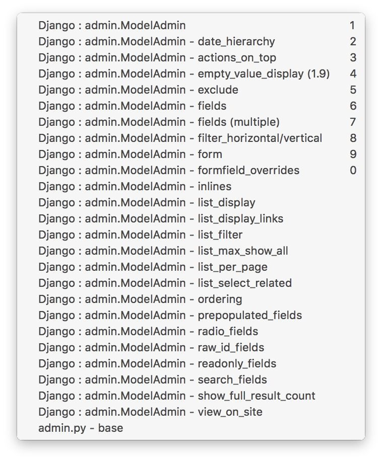

# TextMate2 - Power Tools

This bundle includes most used commands (on a daily basis). Trying to migrate
my old TextMate1 stuff here...

## Installation

```bash
cd "~/Library/Application Support/Avian/Bundles/"
# if you don’t have Avian/Bundles folder, you need to create it!

git clone https://github.com/vigo/textmate2-power-tools.git textmate2-power-tools.tmbundle
# reload your TextMate2
```

## Available Items

### Python

You need to install:

    pip install pep8 autopep8

* `ini`: Initial code for writing Python.
* `imp`: Imports some modules (*os, sys ...*)
* `ase`: All the testing assertions added.
* `p`: print with format
* `pp`: pretty print initializer
* `hlp`: imports from future
* `⌥` + `⌘` + `:` : autopep8 checker.
* `⌥` + `⌘` + `.` : pep8 checker.


### Django / admin.ModelAdmin

* Started Python 3 support for Django
* `admin`: Pops **admin.ModelAdmin** methods.
* `model`: Pops model related helpers.




### Markdown

* `code`: Generates backtick code block for ruby, bash, python, css, js
* `kntrl+c`: Inline code (wraps with backticks)
* `alt+shift+2`: Generates: `’`
* `table`: Generates table code.
* `img`: Generates code for markdown image.
* `badge`: Adds **img.shields.io** badge!

### Javascript

* `con`: Generates `console.log`, `console.dir`, `console.warn`, `console.error`
* `for`, `if`, `swi`

### jQuery

* `plugin`: Generates jQuery plugin skel.
* `each`, `ready`

### HTML

* `alt+shift+2`: Generates: `&rsquo`

### Rake

* `tasr`: New remote task
* `tasd`: Default task
* `inv`: Invoke task
* `des`: Description only
* `tas`: Task with args / Task with args and dependents

### Text

* `lorem`: Generates various Lorem Ipsum texts.

### Middleman

* `more`: Generates `READ_MORE`

### General: Date and Time

* `dateT`: Generates various date and time formats in Turkish.

### Templates

* Bash Script Template, `temp` generates Bash Script Scaffold.

## Change Log

**2017-02-26**

* Elixir support added

**2017-01-09**

* `pep8` and `autopep8` for python.
* `badge` img.shields.io integration for markdown.

**2016-11-29**

* added: Swift snippets; `p`, `=`, `typ`

**2016-10-08**

* added: `admin_modeladmin.png`
* added: `img` for Markdown.

**2016-06-07**

* added: Python testing assertions.

**2016-05-11**

* added: Python `init` and `utf` snippets
* added: Rake helpers

**2016-03-28**

* added: admin.ModelAdmin helpers

**2016-03-28**

* added: `temp` for `source.shell` scope.

**2016-03-24**

* added: HTML snippets
* added: Date and Time snippets
* added: Markdown / table snippet
* added: Javascript snippets added
* added: Text snippets (Lorem Ipsum)
* added: Custom lib, dji18njs snippets
* added: jQuery snippets

**2016-03-20**

* Initial commit

## Contributer(s)

* [Uğur "vigo" Özyılmazel][contributer-01] - Creator, maintainer

## License

This project is licensed under MIT.

[contributer-01]: https://github.com/vigo
